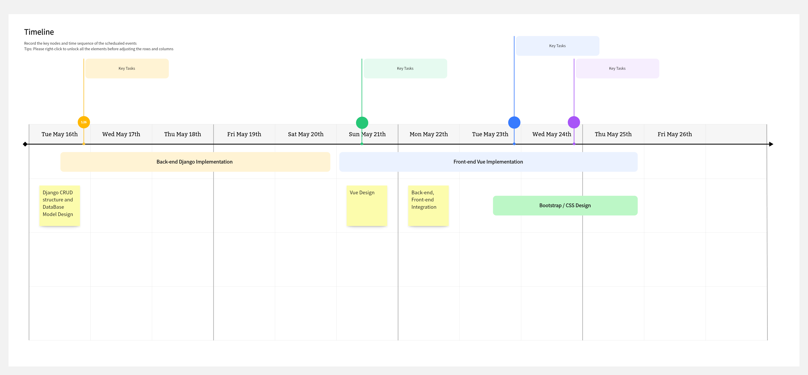

# MovinSide

---

summary

## Table of Contents

---

- first

- second

- third

## Members

---

Yechan Kang, Sanghyeon Lee

## Overview

---

- 영화 추천

- 관련 커뮤니티 기능 구현

## Project Timetable

## Technologies

---

Project is created with:

- Django ?-?

- Bootstrap 3.?

- Python 3.6

- Vue.js ?

- JavaScript ?

---

### Features

- Django-based backend
  
  - Django
  
  - Python 3.6 or later
  
  - ~~[SPA] Accessible from port `3000` for local development~~

- Frontend app with JavaScript (ES2015??), Vue.js
  
  - Vue Router
  
  - ~~[SPA] Accessible from port `8000` for local development~~

---

## Launch

---

## References / Other information

[commit message](https://developer.themoviedb.org/reference/person-combined-credits)

[TMDB API 종류들](https://developers.themoviedb.org/3/getting-started/popularity)

[영화 시리즈들. collection](https://www.themoviedb.org/collection/131296-thor-collection)

영화 콜렉션 리스트는 N:M

-OST는 유튜브 URL을 넣어서 끝

[영화 대본](https://www.themoviedb.org/collection/131296-thor-collection)

크롤링. 특정 요소 밑에 있는 것 다 긁어오기.
b 테그 긁어와서 parsing
sqlite3의 데이터 타입 CLOB(CHAR Large object) 도 text로 받을 수 있다고 함.

-좋아요, 어카운트, 스크랩, 영화 좋아요 목록,

-m대m은 중계 테이블 하나 더 만들어서 1:m, m:1 로 만들기
